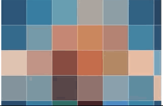
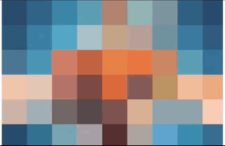
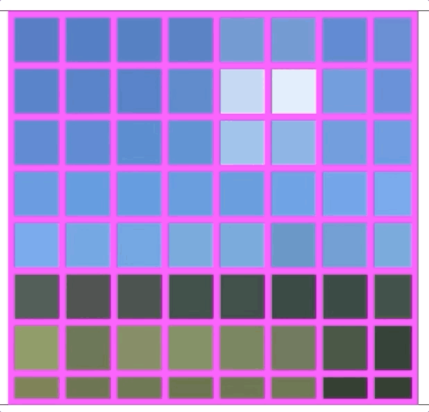
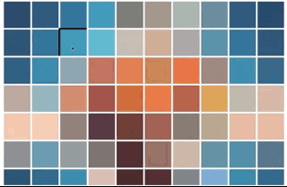

# Interactive pixelator

upload image and make interactive pixel art

## Feature

<table width="100%" align="center">
<tr>
<th colspan="2">Feature</th>
</tr>
<tr>
<td align="center"><strong>Change pixel size</strong></td>
<td align="center"><strong>Change grid size</strong></td>
</tr>
<tr>
<td align="center">

</td>
<td align="center">

</td>
</tr>
<tr>
<td align="center"><strong>Chnage grid color</strong></td>
<td align="center"><strong>Draw freely</strong></td>
</tr>
<tr>
<td align="center">

</td>
<td align="center">

</td>
</tr>
</table>
