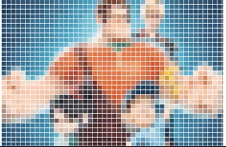

# Pixelator

🌇 🌃 upload image and make interactive pixel art 🕹

## Feature

<table width='500px' >
<tr>
<th colspan="2">Original Image</th>
</tr>
<tr>
<th colspan="2">
</th>
</tr>
<tr>
<td align="center"><strong>Change Pixel size</strong></td>
<td align="center"><strong>Change Grid size</strong></td>
</tr>
<tr>
<td align="center">

</td>
<td align="center">

</td>
</tr>
<tr>
<td align="center"><strong>Chnage Grid color</strong></td>
<td align="center"><strong>Draw freely</strong></td>
</tr>
<tr>
<td align="center">

</td>
<td align="center">

</td>
</tr>
<tr>
<td colspan="2" align="center"><strong>Chnage Pixel type</strong></td>
</tr>
<tr>
<td align="center">

</td>
<td align="center">

</td>
</tr>
</table>

## How to use

I used create-react-app ! ☺️

```BASH
$ git clone https://github.com/taenykim/interactive-pixelator.git
$ cd example/demo-cra
$ npm install
$ npm start
```
